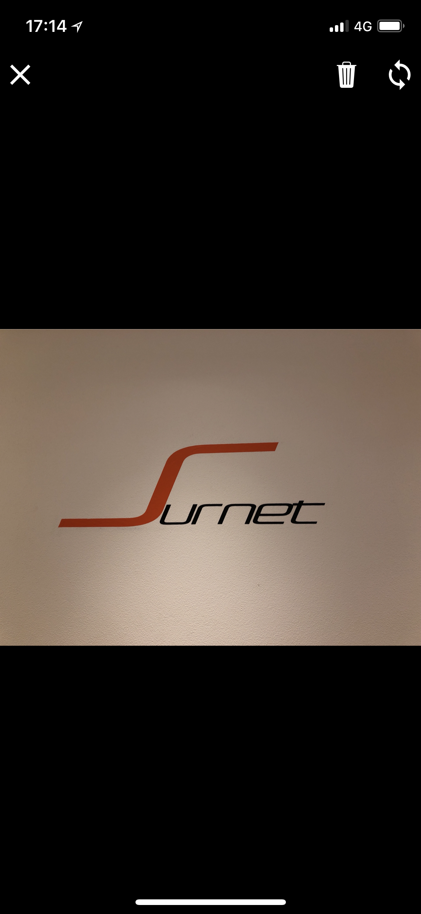

# Unmaintained

This project is no longer maintained.

# ionic-multi-camera

This package allows an Ionic App to take multiple photos in one go.

The "standard" [Camera Plugin](https://ionicframework.com/docs/native/camera/) allows to take one photo per go.
Whereas this package allows to take multiple photos in a row and confirm all of them at once.

Supports iOS and Android

[](https://www.npmjs.com/package/ionic-multi-camera)
[](https://www.npmjs.com/package/ionic-multi-camera)

## Example




## Install

First install the package from npm.

```bash
npm install --save ionic-multi-camera
```

To use this package you need to install the Cordova and Ionic Native Plugins it depends on.

```bash
# Install Ionic Native Plugins
npm install --save @ionic-native/core @ionic-native/camera-preview @ionic-native/device-motion @ionic-native/file @ionic-native/status-bar
# Install Cordova Plugins
ionic cordova plugin add https://github.com/cordova-plugin-camera-preview/cordova-plugin-camera-preview.git
ionic cordova plugin add cordova-plugin-device-motion
ionic cordova plugin add cordova-plugin-file
ionic cordova plugin add cordova-plugin-statusbar
```

The Cordova Plugin Camera Preview requires to add a *NSCameraUsageDescription* for iOS 10+.
Add this to your **config.xml**.

```xml
<edit-config file="*-Info.plist" mode="merge" target="NSCameraUsageDescription">
    <string>Take photos</string>
</edit-config>
```

Because the camera is placed in the background of the Webview you need to remove all backgrounds for the App.
This means some extra work in the rest of your App to add a background.
Add this to your **app.scss**.

```css
ion-app, ion-content, .nav-decor {
  background-color: transparent !important;
}
```

The package allows to customize the used toolbar colors.
Because of that you need to add a new color named *camera* to your **variables.scss**.

```scss
$colors: (
  camera: #000,
  ...
);
```

You need to import the *IonicMultiCameraModule* to your AppModule.
Add this to your **app.module.ts**.

```ts
import { NgModule } from '@angular/core';
import { IonicMultiCameraModule } from 'ionic-multi-camera';

@NgModule({
  ...
  imports: [
    IonicMultiCameraModule.forRoot(),
    ...
  ],
  ...
})
export class AppModule {}
```

## Usage

To use the library the function *getPicture* can be used and returns a Promise with an Array of [Pictures](src/classes/picture.ts).

```ts
import { Component } from '@angular/core';
import { IonicMultiCamera, Picture } from 'ionic-multi-camera';

@Component({
  selector: 'example-page',
  templateUrl: 'example.html'
})
export class Example {

  constructor(
    private camera: IonicMultiCamera
  ) {

  }

  public startCam(): void {
    this.camera.getPicture()
    .then((pictures: Array<Picture>) => {
      ...
    })
    .catch(err => {
      console.error(err);
    });
  }

}
```

If you would like to you can pass CameraPreviewPictureOptions directly to the camera.
This allows to set the expected quality of the pictures.

It also accepts an object containing [Translations](src/classes/translations.ts) for the camera.
Otherwise defaults to English.

```ts
import { IonicMultiCamera, Picture, CameraTranslations } from 'ionic-multi-camera';
import { CameraPreviewPictureOptions } from '@ionic-native/camera-preview';
...

...
const pictureOptions: CameraPreviewPictureOptions = {
  quality: 80,
  width: 4096,
  height: 4096
};
const translations: CameraTranslations = {
  cancel: 'Cancel',
  finish: 'Finish',
  auto: 'AUTO',
  on: 'On',
  off: 'Off'
};
this.camera.getPicture(pictureOptions)
.then((pictures: Array<Picture>) => {
  ...
})
.catch(err => {
  console.error(err);
});
...
```
